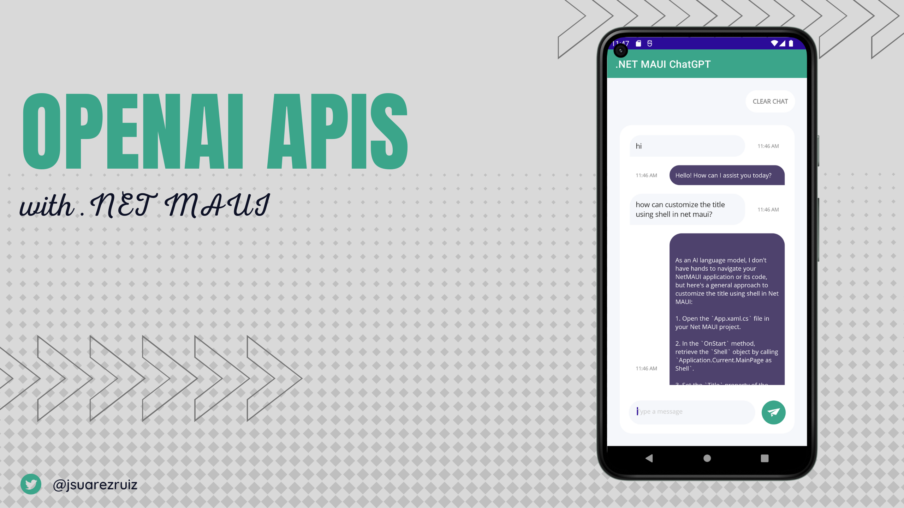

# OpenAISharp

C# .NET wrapper library to use with OpenAI APIs. This is an unofficial wrapper library around the OpenAI API to perform different tests with a .NET MAUI App.

This repository includes a .NET MAUI ChatGPT client (_work in progress_).

 

To make the app work, you need to set the [OpenAI API Key](https://platform.openai.com/account/api-keys) at MauiProgram.cs.